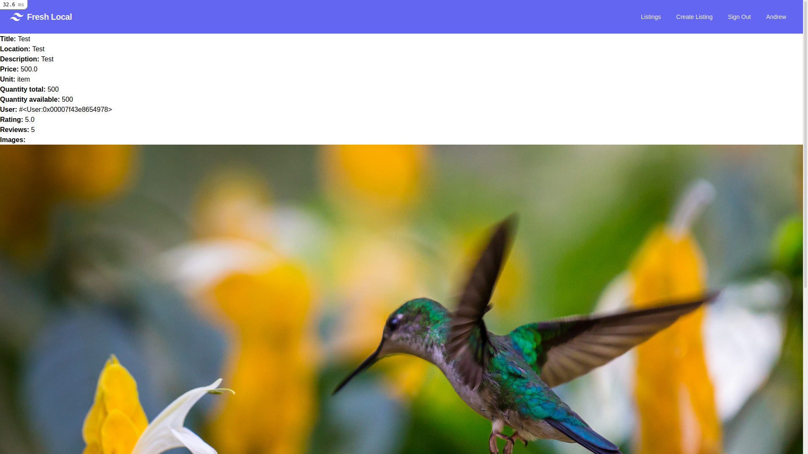

# README

## A Note

This project is not a true demonstration of my skills as junior developer. I became extremely sick over the course of this project, suffering from gastroenteritis which exacerbated my longstanding chronic fatigue. Despite being awarded an extension I have been unable to complete this and I am submitting this project as is, in its unfinished state in an attempt to pick up what marks I can and take a week off to relax and recover before Term 3. I am extremely disappointed with what I have made here. Beyond this assessment, this application will not be used as a portfolio project without some serious improvement.

- The views are incomplete and poorly implemented, using inline styling with TailwindCSS but with many Rails scaffold elements remaining. As Stripe takes prices in cents I fully intended to create a method to call every time this need to be converted for views. I didn't.

- The application doesn't work. While the checkout redirect does work, the params are not correctly passed, resulting in a 422 error. While accounts can be linked to Stripe Connect in order to receive payments, the service is not fully implemented and it does not communicate with the checkout, nor is there any business logic preventing users without Stripe accounts from creating new listings.

- While images can be uploaded, there was intended to be a limit of 5. There is no logic to make image attachments a requirement and no functionality to add or delete images associated with a listing.

- I intended to implement a search feature, however this was not completed. There is some evidence of this in branches on GitHub. Early (and broken) implementation attempts for other features are included in some branches on GitHub that were not merged into Main.
- A dedicated Order model would likely streamline the process for implementing further features
- I had planned to add unit_size in a future migration so sellers could specify the size of a unit. For example 500g or 1kg. The ordered quantity would then be subtracted from the quantity available once payment was processed. On successful payment, buyers would then be able to instant message the seller

## The Problem

In the midst of the global pandemic in 2020, the number of people establishing gardens and growing their own vegetables has surged. With the increased time spent at home, people have the time to tend to gardens. The panic buying and the supply chain disruptions caused by the pandemic have highlighted issues such as food security in the minds of consumers. Having your own garden means you are less reliant on supermarkets. This coupled with authorities encouraging people not to travel has created an environment where people are growing vegetables and remaining in their communities.

There are signs that urban farming will continue to grow post-pandemic. The main reasons being that the pandemic has highlighted flaws with how our supply chains are structured, with locally grown produce resulting in a more resilient food supply, reducing transportation-related emissions, encouraging better diets and as a way to save money.

Sources: [ABC Australia](https://www.abc.net.au/everyday/growing-your-first-veggie-garden-during-the-pandemic/12612032), [Newcastle Herald](https://www.newcastleherald.com.au/story/6989042/the-revival-of-backyard-gardens-that-grew-out-of-the-pandemic/) and [The Conversation](https://theconversation.com/urban-farming-four-reasons-it-should-flourish-post-pandemic-144133)

What is missing is a way to capitalise on this. We have all met people who accidentally grew a mountain of tomatoes or zucchinis and you have a kilogram foisted upon you every time you see them. A dedicated marketplace focusing purely on locally grown produce enables people to monetise the excess food grown and encourage more people to do the same, all while keeping profits within communities. Such a marketplace would fill a niche that is not well served by general marketplaces such as Gumtree and Facebook Marketplace. An added incentive to use this service over a more general marketplace is to reduce the associated friction with haggling and bartering, although Veggie Marketplace should still feature messaging.

## Live Site

The marketplace is deployed on Heroku:

http://veggie-marketplace.herokuapp.com/

## Source Code
The source code for this project can be found on GitHub:

https://github.com/theandrewfulton/marketplace-app

## The Marketplace App

### Purpose

The purpose of the marketplace is to facilitate easily buying and selling homegrown produce in and around a user's local area.

### Target Audience

The target audience is people who grow their own produce in towns and cities in Australia in addition to buyers who want to shop locally, potentially increase their food security or are interested in reducing their carbon footprint while eating healthily.

### Tech Stack

- Basic site: HTML and CSS through TailwindCSS
- Logic and full-stack functionality: Ruby on Rails
- Database: PostgreSQL with ruby translated into SQL with ActiveRecord
- Tailwind CSS and Stripe functionality: Javascript
- Deployment hosting: Heroku with a Procfile to automatically perform database migrations on deployment
- Source code hosting: GitHub

### Functionality / features
#### Implemented

- Any site visitor is able to view listings created by registered users.
- Visitors can register on the site to buy produce in an individual listings
- Standard, Moderator and Super User roles are implemented with the CanCanCan gem for Ruby on Rails
- The creator of a listing can edit and delete it but other users cannot. Moderators can edit listings but cannot delete them and Super Users can edit and delete any listing.
- The Listings table contains columns for tracking the quantity in inventory, although the feature is not implemented

#### Planned but not Implemented

- Messaging between buyer and seller after purchase to arrange pick-up

- Search

- More sophisticated views with logic for which buttons are displayed to which users

- The Buy button redirects to a payment gateway provided by Stripe however there are unresolved issues with params

- Stripe Connect - enabling sellers to receive payment has been added but is not implemented into the checkout or any of the business logic

- Reviews and Ratings of Sellers
- Some unit tests written for Listing table validation, however some scaffolded tests are failing

### Screenshots





## User Stories

- As a seller I want to create and edit a listing so buyers and buy my products
- As a buyer I want to view images on listings so I can make a more informed choice
- As a seller I want to upload images of my listing to show customers what they are getting
- As a seller I don't want unwanted changes made to my listings by other users so that my listing reflects the product and no unauthorised changes are made
- As a seller I want ratings and reviews to be left on my listings/profile so other buyers choose my listing over a competing offer.
- As a buyer I want to buy quantities from a listing so I can collect it
- As a buyer I want the option to be able to buy produce in listings so I can eat them
- As a buyer I want to leave ratings and reviews so future buyers can be better informed about good and bad experiences
- As a viewer I want to view listings in my area so I can see what is available
- As an administrator I want to monitor and moderate listings so the marketplace remains a safe and enjoyable place

## Wireframes

As noted above, the views are far from complete and as a result are quite different to the wireframes displayed below. These wireframes were created before I did any research on Tailwind CSS and its capabilities. Wherever possible, templates were used in order to reduce the time spend on styling and this resulted in differences from the wireframes. As development of the app progressed some fields also changed and others have not been implemented.


## ERD


## Explain the different high-level components (abstractions) in your *app*

Ruby on Rails follows a Model-View-Controller (MVC) structure. The model is responsible for the database and communicating with the rest of the app and it includes modules such as ActiveRecord which enables this and validation for database entry. The Views consist of what is rendered in the browser, incorporating HTML, CSS and Javascript. It includes images and forms and may also include rudimentary business logic to show or hide elements based on factors such as user permissions. The Controller is responsible for linking the views to the model and applying more complex business logic. Access to each view, as well as functionality such as creating, editing and destroying data is handled by a Routes file.

The Listing model consists of a database table with the fields shown in the Entity Relationship Diagram below. The listing views consist of the application homepage showing all of the listings with basic logic to show a welcome banner if a user is not logged in, in addition to the view of individual listings, create and edit pages. The content of each of these views beyond basic HTML and styling is controlled by a separate logical method in the controller. When the user buys an item, the details of the sale are returned to the controller. The quantity bought dictates the changes to quantity available in the model and ensures it is not less than zero. If the quantity available is zero, the controller updates the "sold" boolean and the listing disappears from the view for future users. When a listing is created. The ID of the user who created it (stored in the user table and accessible by the user model) is added to the user field for the listing. This is handled on the model level and does not need to be entered in the view.

## Third Party Services

- GitHub - Source code hosting and management
- Cloudinary - Image hosting through ActiveStorage and a content distribution network for faster loading times
- Heroku - Application deployment and production database management (migrations)
- Heroku Postgres - Production database hosting
- Stripe Checkout - Checkout and credit card payment handling (not functional)
- Stripe Connect - Payments for Sellers (not functional)
- Pusher - Instant messaging (not functional), considered switching
- Bonsai Elasticsearch - Elasticsearch hosting for production. Usually I would include instructions for installing elasticsearch locally however it was not implemented

## Active Record Associations

The User model has many listings and conversely the Listing model belongs to users. The Listing model also has many images attached, through the ActiveStorage module.

## Database Relations

-

## Database Schema

```ruby
ActiveRecord::Schema.define(version: 2021_03_26_091117) do

  # These are extensions that must be enabled in order to support this database
  enable_extension "plpgsql"
# ActiveStorage Tables for image hosting and attachments for listings
  create_table "active_storage_attachments", force: :cascade do |t|
    t.string "name", null: false
    t.string "record_type", null: false
    t.bigint "record_id", null: false
    t.bigint "blob_id", null: false
    t.datetime "created_at", null: false
    t.index ["blob_id"], name: "index_active_storage_attachments_on_blob_id"
    t.index ["record_type", "record_id", "name", "blob_id"], name: "index_active_storage_attachments_uniqueness", unique: true
  end

  create_table "active_storage_blobs", force: :cascade do |t|
    t.string "key", null: false
    t.string "filename", null: false
    t.string "content_type"
    t.text "metadata"
    t.string "service_name", null: false
    t.bigint "byte_size", null: false
    t.string "checksum", null: false
    t.datetime "created_at", null: false
    t.index ["key"], name: "index_active_storage_blobs_on_key", unique: true
  end

  create_table "active_storage_variant_records", force: :cascade do |t|
    t.bigint "blob_id", null: false
    t.string "variation_digest", null: false
    t.index ["blob_id", "variation_digest"], name: "index_active_storage_variant_records_uniqueness", unique: true
  end

    # Listings table
  create_table "listings", force: :cascade do |t|
    t.string "title"
    t.string "location"
    t.text "description"
    t.float "price"
    # unit allows unit (namespace issue with calling it "each", g and kg)
    t.integer "unit", default: 0
    t.integer "quantity_total"
    t.integer "quantity_available"
    t.float "rating"
    # Review foreign key for record ID in Review Table that was not implemented
    t.integer "reviews"
    t.boolean "sold"
     # Rails Boilerplate for tracking when records were created and updated
    t.datetime "created_at", precision: 6, null: false
    t.datetime "updated_at", precision: 6, null: false
    # User ID foreign key for the user who created the listing
    t.bigint "user_id", null: false
    # boilerplate to increase database performance by indexing listings
    t.index ["user_id"], name: "index_listings_on_user_id"
  end

    # Users table - Created by Devise
  create_table "users", force: :cascade do |t|
    t.string "email", default: "", null: false
    # First Name field added in later migration
    t.string "first_name", default: "", null: false
    # Last Name column added in later migration
    t.string "last_name", default: "", null: false
    t.string "encrypted_password", default: "", null: false
    # Rating (not implemented)
    t.float "rating"
    t.string "reset_password_token"
    t.datetime "reset_password_sent_at"
    t.datetime "remember_created_at"
    t.datetime "created_at", precision: 6, null: false
    t.datetime "updated_at", precision: 6, null: false
    # Columns added for Stripe Connect for Seller payments
    t.string "uid"
    t.string "provider"
    t.string "access_code"
    t.string "publishable_key"
    # Role, accepts "Normal", "Super User" and "Moderator"
    t.integer "role", default: 0
    # Indexing for performance:  
    t.index ["email"], name: "index_users_on_email", unique: true
    t.index ["reset_password_token"], name: "index_users_on_reset_password_token", unique: true
  end
# Foreign keys where table primary keys are referenced in columns of other tables
  add_foreign_key "active_storage_attachments", "active_storage_blobs", column: "blob_id"
  add_foreign_key "active_storage_variant_records", "active_storage_blobs", column: "blob_id"
  add_foreign_key "listings", "users"
end
```

## Project Management

The overall project was managed using elements of the Agile Methodology. Tasks were planned by taking the perspectives of users and creating user stories to achieve the basic functionality of the app. These stories were then added to cards in Trello and labelled according to to the expected time to implement, the priority and the area. Documentation and organisation-related tasks were added as a simple task rather than as user stories. Each card was then transferred between "To Do", "In Progress", and "Complete" columns as appropriate.

The Trello Board for the project can be found [here](https://trello.com/b/jn1Ottsj/2-sided-marketplace).
